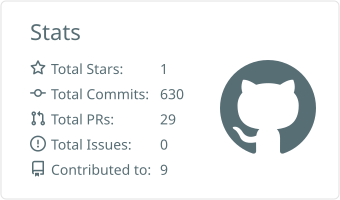
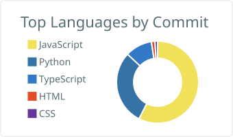
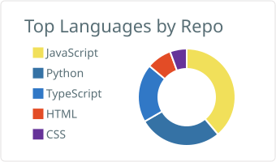
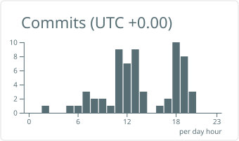

<h1 align="center">Hi, I'm Haris Ahmed Khan 👋</h1>

  <b>Backend Developer & Team Lead @ Dev Dimensions</b> 
  Building scalable Python backends, data platforms and AI-powered products.

  
  
  

---

## 👨‍💻 About Me

I'm a backend-focused software engineer and team lead with a strong grip on full-stack development. Day to day I:

- 🧠 Build an **AI-powered data analytics platform** that turns raw data into insights
- 🏢 Architect a **multi-tenant HRM system** in Django
- 🛠️ Design APIs, data pipelines and cloud infrastructure that hold up in production
- 👥 Lead a team, review code and help ship reliable software
- 🌱 Exploring open-source contributions in the Python ecosystem

I'm a team player who's always willing to go the extra mile to get the job done.

## 🛠️ Tech Stack

**Languages** 

**Backend & Data** 

**Frontend & Desktop** 

**Cloud & DevOps** 

## 📈 GitHub Activity

<!-- These cards are generated by the "GitHub Profile Summary Cards" workflow in this repo
     and served from the repo itself, so they don't depend on a shared third-party server. -->

  <picture>
    <source media="(prefers-color-scheme: dark)" srcset="./profile-summary-card-output/github_dark/3-stats.svg">
    
  </picture>
  <picture>
    <source media="(prefers-color-scheme: dark)" srcset="./profile-summary-card-output/github_dark/2-most-commit-language.svg">
    
  </picture>

  <picture>
    <source media="(prefers-color-scheme: dark)" srcset="./profile-summary-card-output/github_dark/1-repos-per-language.svg">
    
  </picture>
  <picture>
    <source media="(prefers-color-scheme: dark)" srcset="./profile-summary-card-output/github_dark/4-productive-time.svg">
    
  </picture>

---

  Spare some time to explore my <a href="https://hariskhan-app.vercel.app/"><b>portfolio</b></a> ✨

